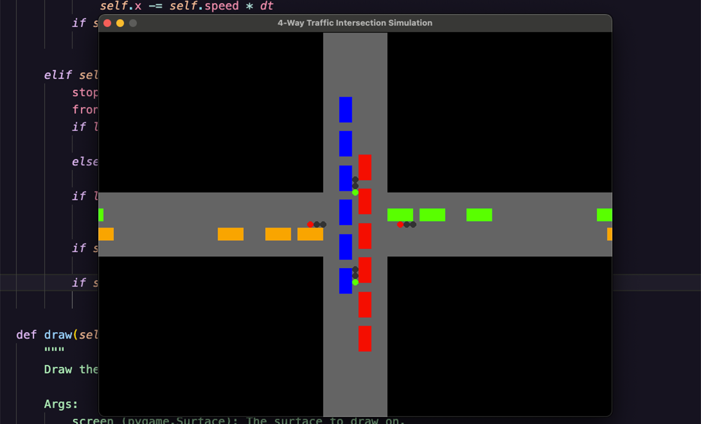

# Traffic Light Simulator

A 4-way traffic intersection simulator created with Python and Pygame. 



This was created entirely from Grok3.

The simulation features:

- Realistic traffic light cycles
- Vehicle movement and collision avoidance
- Multi-directional traffic flow
- Color-coded vehicles based on direction

## Features

- Traffic lights cycle between green, yellow, and red states
- Cars spawn from four directions (north, south, east, west)
- Vehicles stop at red lights and maintain safe distances
- Smooth vehicle movement and traffic flow
- 800x600 window resolution

## Requirements

- Python 3.x
- Pygame

## Installation

1. Clone this repository
2. Install pygame:
```bash
pip install pygame
```

## Usage

Run the simulation:
```bash
python main.py
```

Controls:
- Close window to exit simulation

## License

This project is licensed under CC0 1.0 Universal. See [`LICENSE`](LICENSE) file for details.

## Preview

- Green traffic light phase: North-South traffic flows while East-West waits
- Yellow transition phases prevent sudden stops
- Red light phase: Traffic stops while cross-traffic moves
- Cars maintain safe distances and follow traffic rules# Pygame_Traffic_Light_Simulator
Traffic light simulator written in Python using the Pygame framework. Entirely generated by Grok3. 
